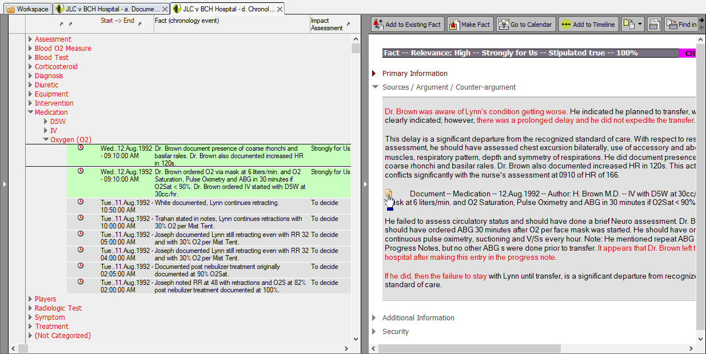
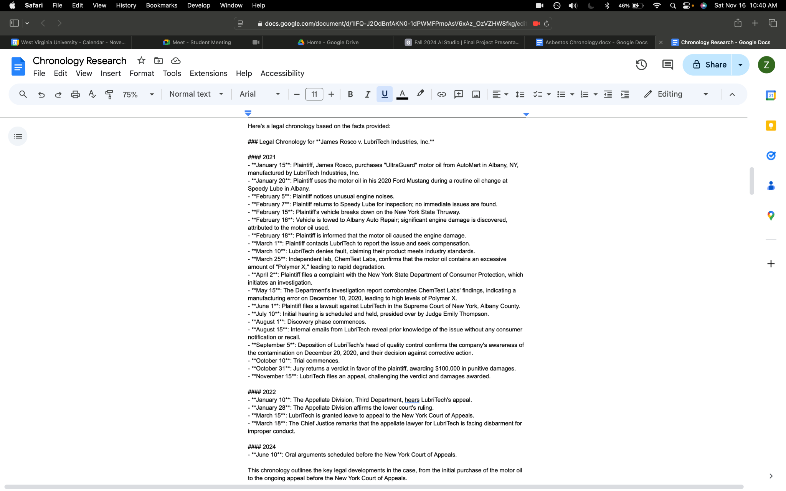
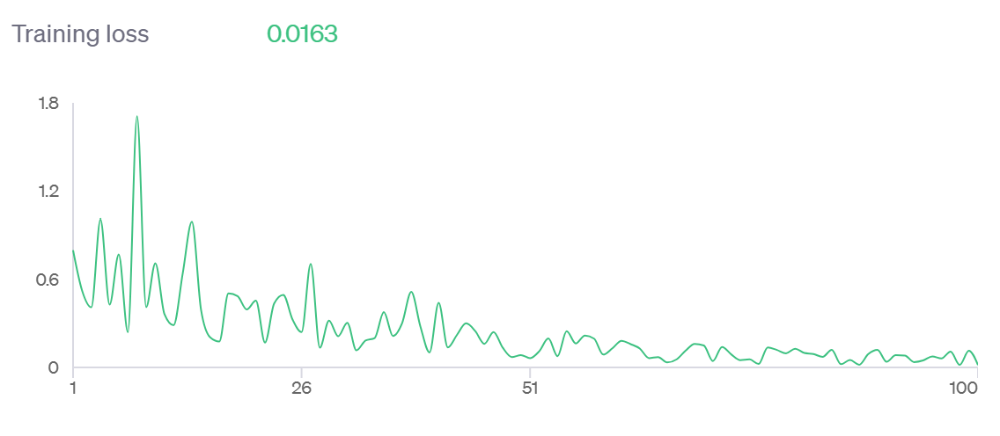
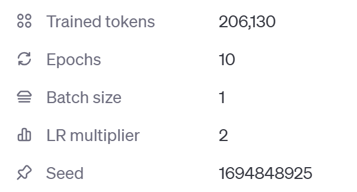
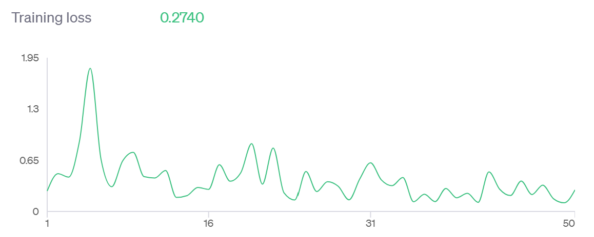
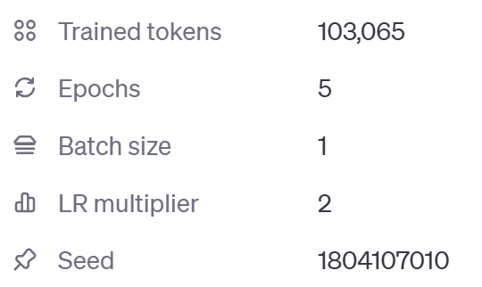
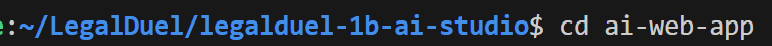

# Chronology Creation, LegalDuel
## Fall 2024, AI Studio Project, legalduel-1b-ai-studio
## Authors: Tiffany Fu, Yomna Elmousalami, and Zoe Bailey.

<ins> Table of Contents </ins>
- [Business Focus](#business-focus)
- [Data Preparation and Validation](#data-preparation-and-validation)
- [Approach](#approach)
- [Key Findings and Insights](#key-findings-and-insights)
- [Potential Next Steps](#potential-next-steps)
- [Installation](#installation)
- [Usage](#usage)
- [Documentation](#documentation)
- [Contributing](#contributing)
- [License](#license)
- [Credits and Acknowledgements](#credits-and-acknowledgements)
- [Sources](#sources)
  
# Business Focus
The goal of the project was to develop AI-driven solutions for common legal tasks, including content generation. For this project, we developed an AI driven web application to create legal chronologies from a set of given text documents provided by the LegalDuel platform. Chronologies are documents that outline a timeline of events, regarding a legal case. They are typically compiled by an attorney sifting through vast amounts of interviews, emails, and other documents to build a timeline. The purpose of creating this AI web application was to make it eaiser for lawyers to spend less time tediously creating chronologies, so instead they can focus on other pressing issues. Additionally, this project is useful for customers at law firms because with more time, competition, and innovation from our AI tool, law firms can help clients more efficiently for less money. Lastly, our project will our allow for more competition and innovatative solutions since new and unique solutions arise from increased competition, since AI tools are being constantly added into the legal sector. 

### Example of a legal Chronology:
<br>


# Data Preparation and Validation
## Dataset Overview
We were given given 30 samples of mock interviews, emails, and other documents. They are not real case scenarios. All of the data was on .docx format and there was a total of 701 KB of data.

### A Sample Data set:
<br>


## Exploratory Data Analysis
We read the sample documents provided to us, made the chronologies by hand, and compared our results against popular online AI tools (Chat GPT, Claude). The AI tools performed fairly well against our handmade chronologies since our chronologies and the AI ones generated errors at a similar rate.

### Example Chronology generated from ChatGPT:
<br>


## Data Cleaning and Preprocessing
The first step in this process was converting the documents from .docx to plain text format. Afterwards, we experimented with date and event extraction using libraries such as SpaCy, Stanford Core NLP, and Duckling on Google Colab. However, after going through this process we realized that integrating a ChatGPT model with Spacy would be eaiser since SpaCy already has cleaning and natural language preprocessing built in, and ChatGPT models allows for a chat completetions response generation. 

### Example of Spacy Entity Identification Code on Google Colab:
<br>


### Example of Spacy Date Extraction Code on Google Colab:
<br>


### Example of Spacy and ChatGPT code and response in text:
<br>


# Approach
## Selected Models
We selected two candidate models to explore which one produced the best chronologies. 
- gpt-3.5-turbo-0125: We selected this model because it had a low cost in training.
- gpt-4o-2024-08-06: We selected this model because of its increased accuracy of generating the best responses, despite the cost of training being high.
  
## Prompt Engineering
To generate the best chronology with our two selected models, we decided to use prompt engineering, which is a set of instructions used to generate the best output for our model. To generate the best prompt we decideded to use specific keywords to define our ideal output. For example we stated how we wanted our model to follow the format of 'DATE (MM/DD/YYY): EVENT SUMMARIZATION' as well as 'UTC' format. This gave it a frame of reference on how we wanted our output to be produced instead of saying create a chronology. After specifying our prompt, we decided to use the OpenAI Chat Completions API endpoint to generate the chronologies. The purpose of a chat completions endpoint is to simulate the interaction of a user and the chatbot creating text generated output, based on the user input. 

**Example of prompt engineering and Chat Completions endpoint:**
<br>
<br>

<br>

As seen in the image, the prompt was created using prompt engineering. Meanwhile the chat completions api starts from the line that states "response" and ends with "summary=...." The chat completions api contains a messages section which specifies the role and the content associated with each role. The first role that is specified is "system" which allows you to specify the behavior of the model that you are using. The second role that is specified is the "user" role which acts as a user who is typing an input into the chatbot. In the code above, the content of the role "system" is given the prompt we created with prompt engineering and the content of the role user is give the document text that the user enters when using the web application. Afterwards, the line "summary = response.choices[0].message.content" is the output of the model, otherwise known as the chronology. 

## Model Trianing 
### traning1.jsonl
We decided to train our model with the OpenAI Dashboard. We created 10 training examples in training1.jsonl using the OpenAI Chat Completions API endpoint input prompt. The purpose of a chat completeions input prompt is to generate an output of a chronology, in text, based on specific parameters. Here is an example of a chat completions input prompt:

{"messages": 
<br>
[{"role": "system", "content": "Please take the following document and create a chronology. Follow a format of 'DATE (Month Day, Year): EVENT SUMMARIZATION'. Seperate each event with a new line character. Make sure the dates are in chronological order. Take your time, and make sure to think through it as to minimize error."},
<br>
{"role": "user", "content":"John: I believe that I saw his car out last Tuesday, sorry it was on Wednesday actually. "},
<br>
{"role": "assistant", "content":"October 30, 2024: John saw the car."}]}

**Explanation of Chat Completions Input:**
As seen above, the "messages" section is where you can customize your desired model. Within each message there is a set of roles and content associated with each role. In our above examples, we specified each role with either "system, "user," or "assistant." The "system" role allows you to specify the behavior of the model that you are using. The role of "user" acts as a user who is typing an input into the chatbot. And, the role of "assistant" is the desired response that the model should produce. The "content" is the query or response associated with each role. In the above example, the "system" role is acting as an assistant that generates a chronology with specific instructions, although the word "assistant" is not specified. Meanwhile, the "user" role contains an input response (content) that a user puts into the chatbot. And finally, the content associated with the "assistant" role contains a sample output response that it should provide. 

**Model Hyperparameters to train with:**
We decided to train the models based on the hyperparameters of the number of epochs, batch size, and LR multiplier. 

# Key Findings and Insights

### Key Findings
gpt-3.5-turbo-0125 (default parameters): We utilized the default training hyperparameter values: 3 epochs, 1 batch size, and an LR multiplier of 2. The purpose of doing this was to see how the default values would measure, compared to adjusted hyperparameter values. Although the training cost was low, it did produce a significantly high training loss of 0.8. This suggests that the model is most likely underfitting. 

gpt-4o-2024-08-06: Because the default hyperparameter values did not produce the best results, we decided to try different hyperparameters for this model: 10 epochs, 1 batch size, and an LR multiplier of 2. As a result, the training loss was significantly lower: 0.0027. Although a low training loss is usually good, this training loss is significantly low. This suggests that the model is most likely severly overfitting. 

**gpt-3.5-turbo-0125 default training hyperparameters with results:**
<br>
<br>


**gpt-4o-2024-08-06:**
<br>
<br>


### training_formatted.jsonl
After seeing the results from training1.jsonl, we decided to try more refined, longer, but same syntaxed examples to better prompt engineer our examples being fed to the models. Similar to training1.jsonl, we used chat completions to create 10 more training examples. To see how they were formatted, go to the section titled "training1.jsonl."

### Key Findings
gpt-3.5-turbo-0125 (10 epochs): We utilized the default training hyperparameter values: 10 epochs, 1 batch size, and an LR multiplier of 2. The purpose of doing this was to see how increasing the epochs affected the training loss. The training loss was 0.0163, which was significantly lower than the model with default parameters, but it had a slightly higher cost than gpt-3.5-turbo-0125 with the default parameters.

gpt-3.5-turbo-0125 (5 epochs): We utilized the default training hyperparameter values: 5 epochs, 1 batch size, and an LR multiplier of 2. The purpose of doing this was to see how a value between 3-10 epochs affected the training loss. The training loss was about 0.2, which is significantly lower than the model with default parameters, but it had a slightly higher cost than gpt-3.5-turbo-0125 with the default parameters. Also this model may not be overfitting as much as gpt-3.5-turbo-0125 (10 epochs), as seen by the differences in their training losses. 

**gpt-3.5-turbo-0125 (10 epochs) with results:**
<br>
<br>



**gpt-3.5-turbo-0125 (5 epochs) with results:**
<br>
<br>



### Insights
- The jsonl files did not necessarily have an affect on the training losses. We just wanted to create more refined examples to optimize the prompts with prompt engineering. 
- gpt-4o-2024-08-06 is better at reducing training loss but has a high cost.
- However, gpt-3.5-turbo-0125 (default parameters) had a high training loss, indicting that the model may be underfitting. 
- However, gpt-3.5-turbo-0125 (5 epochs) also had a low training loss but a lower cost. Therefore, it was the best model we tested. 
- Although gpt-3.5-turbo-0125 (5 epochs) performed the best, the high epoch numbers of gpt-4o-2024-08-06 and gpt-3.5-turbo-0125 (10 epochs), may have caused the models to overfit, as seen by the training losses.
- When submitting our bot to the LegalDuel platform to test, it placed 11th out of 13 bots.
- Communication is the best when working with teams, especially when scheduling meetings or if it is your first time working with AI models.

# Potential Next Steps
Some potential next steps we are considering are continintg to finetune both of the models (gpt-3.5-turbo-0125 and gpt-4o-2024-08-06) until we find the ideal hyperparameters that produce the best results, with the lowest training cost. However, we did not train every model, so it would be interesting to continue comparing and contrasting the results. Once we find the best model, we can then see how the models perform with a validation set. Once we find the model that perfoms the best on both the training and validation sets, we are considering trying out different LLMs to see which ones produce the best results. 

# Installation
## Simple Flask App Interface for Chronology Model using GPT-Turbo
#### TO USE
1. `git clone https://github.com/tiffanyfu7/legalduel-1b-ai-studio/tree/main` repository and `cd ai-web-app`
2. `pip install Flask spacy spacy-llm openai python-dotenv`
3. add `.env` file in top ai-web-app directory and add api-key <br>
```OPENAI_API_KEY="{your api key}"``` <br>
    (note: purchase key at <a href="https://platform.openai.com/api-keys">OpenAI Platform</a>)
4. run "python app.py" or "python3 app.py" and test in http://127.0.0.1:5000
6. To stop the program type "CTRL + C"

# Usage

**Note:If you would like to use the sample datasets to try out, please feel free to do so. Just cd into sample datasets.**

1. Type cd ai-web-app into the command line.
2. Type "python app.py" or "python3 app.py"
3. Click "Open in Browser"
4. Once your click the button, you will find the inital layout of the web application. The left most side contains the area where the user can input text and the right hand side is where the output, or chronology, is generated. In the output section, the "Show Text" box is checked but you can also check and uncheck the "Show Timeline" option.
5. You can either enter the next manually (it will say "No File Choosen" next to the "Choose File" button).
6. Or you can upload a pdf version of text (it will say the name of the file next to the "Choose File" button).
7. If a non-pdf file is uploaded, the web application will display an error message stating that you need to select a .pdf file.
8. Click the "Generate Chronology Button" 
9. To see the textual output of the chronology, check the "Show Text" Option 
10. To see the visual timeline of the chronology, check the "Show Timeline" Option
Note: (You check have both the "Show Text" and "Show Timeline" options checked simultaneously)
11. Once the "Show Timeline" option has been checked, you can download the visual timeline by clicking the "Donwload Timeline" Button. This will produce a pdf version of the visual timeline.
12. Once you are done using the program type "CTRL + C"

### Step 1:
<br>


### Step 2:
<br>


### Step 3:
<br>


### Step 4:
<br>


### Step 5: 
<br>


### Step 6:
<br>


### Step 7
<br>


### Step 8
<br>


### Step 9
<br>


### Step 10
<br>
Part of the visual timeline because it is too big to fit here:
<br>


### Step 11
<br>


### Step 12
<br>


# Documentation

Here is some documentation regarding Open AI's chat.completions.create API, which is what we have used in this project for text generation: [Text Generation Open AI](https://platform.openai.com/docs/guides/text-generation). If you would like to access a pdf version of the document, please cd into the "documentation" directory.

# Contributing

Hello, thank you so much for coming across our page. If you would like to contribute to this project, you can follow the instructions provided by this link: [Contribution](https://docs.github.com/en/get-started/exploring-projects-on-github/contributing-to-a-project).

Before contributing, contact the repo owner: username: tiffanyfu7

# License
If you would like to modify the code please follow the Apache License 2.0: [Apache License 2.0](https://www.apache.org/licenses/LICENSE-2.0)

# Credits and Acknowledgements
On behalf of our team, we would like to thank our challenge advisors (Thor Alden, Anthony Puppo, and Kate McGuigan) at LegalDuel for their continued support and collaboration throughout this project. We had so much fun working with AI in the legal sector and cannot wait to explore it more in the future. We would also like to thank our TA (Nandini Proothi) for collaborating with us and giving us advice on how to approach our problem if we ever needed help. Last, but certainly not least, we would like to thank the [Break Through Tech AI](https://www.breakthroughtech.org/) team at Cornell Tech for providing us with this experiential learning oppourtunities as well as the course support needed for students to succceed. We are all excited for what is in store for the future in Spring AI Studio.

# Sources
- Timeline Assistance: https://www.w3schools.com/howto/howto_css_timeline.asp
